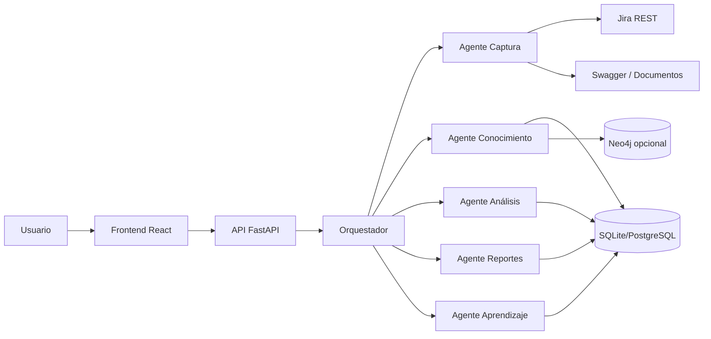
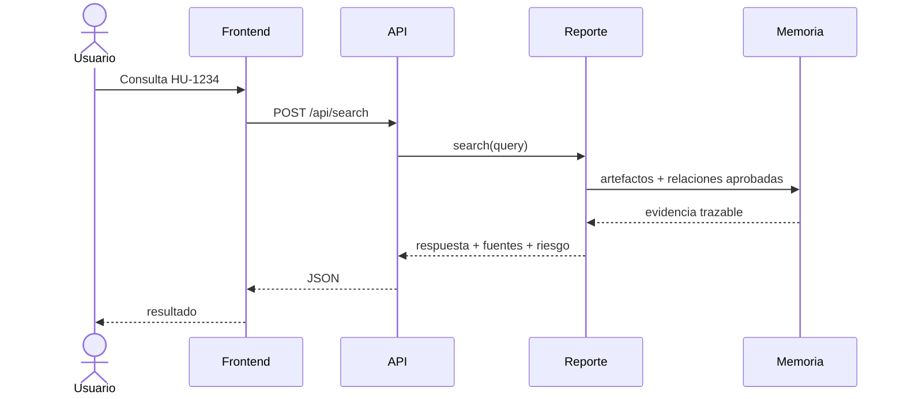
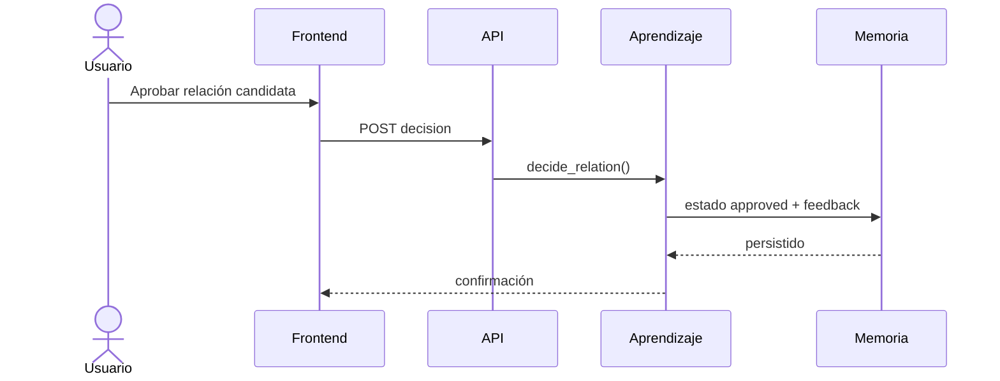

# Diagramas UML en Mermaid

## Componentes

```mermaid
flowchart LR
  U[Usuario] --> F[Frontend React]
  F --> B[API FastAPI]
  B --> A[Orquestador]
  A --> C[Agente Captura]
  A --> K[Agente Conocimiento]
  A --> N[Agente Análisis]
  A --> R[Agente Reportes]
  A --> L[Agente Aprendizaje]
  C --> J[Jira REST]
  C --> S[Swagger / Documentos]
  K --> DB[(SQLite/PostgreSQL)]
  K --> G[(Neo4j opcional)]
  N --> DB
  R --> DB
  L --> DB
```

## Secuencia: consulta de impacto

```mermaid
sequenceDiagram
  actor Usuario
  participant Frontend
  participant API
  participant Reporte
  participant Memoria
  Usuario->>Frontend: Consulta HU-1234
  Frontend->>API: POST /api/search
  API->>Reporte: search(query)
  Reporte->>Memoria: artefactos + relaciones aprobadas
  Memoria-->>Reporte: evidencia trazable
  Reporte-->>API: respuesta + fuentes + riesgo
  API-->>Frontend: JSON
  Frontend-->>Usuario: resultado
```

## Secuencia: aprendizaje por validación

```mermaid
sequenceDiagram
  actor Usuario
  participant Frontend
  participant API
  participant Aprendizaje
  participant Memoria
  Usuario->>Frontend: Aprobar relación candidata
  Frontend->>API: POST decision
  API->>Aprendizaje: decide_relation()
  Aprendizaje->>Memoria: estado approved + feedback
  Memoria-->>Aprendizaje: persistido
  Aprendizaje-->>Frontend: confirmación
```
